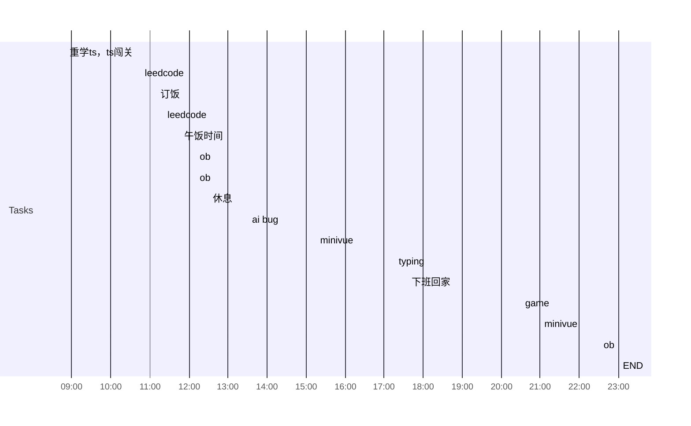

## Day Planner

- [x] 08:50 重学ts，ts闯关
- [x] 10:45 leedcode
- [x] 11:10 订饭
- [x] 11:20 leedcode
- [x] 11:45 午饭时间
- [x] 12:10 ob
- [x] 12:10 ob
- [x] 12:30 休息
- [x] 13:30 ai bug
- [x] 15:15 minivue
- [x] 17:15 typing
- [x] 17:35 下班回家
- [x] 20:30 game
- [x] 21:00 minivue
- [x] 22:30 ob
- [x] 23:00 END