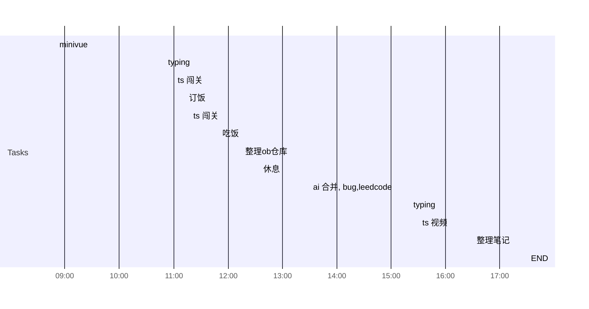

## Day Planner

- [x] 08:50 minivue
- [x] 10:50 typing
- [x] 11:00 ts 闯关
- [x] 11:13 订饭
- [x] 11:18 ts 闯关
- [x] 11:50 吃饭
- [ ] 12:15 整理ob仓库
- [ ] 12:35 休息
- [ ] 13:30 ai 合并, bug,leedcode
- [ ] 15:20 typing
- [ ] 15:30 ts 视频
- [ ] 16:30 整理笔记
- [ ] 17:30 END