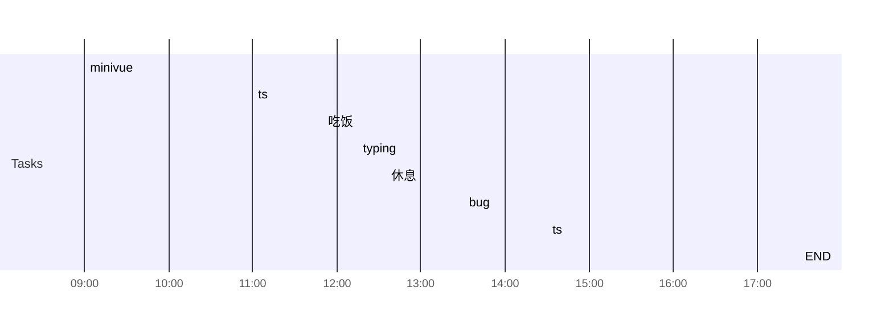

## Day Planner

```mermaid
gantt
    dateFormat  HH-mm
    axisFormat %H:%M
    %% Current Time: 下午5:32:05
    section Tasks
    minivue     :09-00, 120mm
    ts     :11-00, 50mm
    吃饭     :11-50, 25mm
    typing     :12-15, 20mm
    休息     :12-35, 55mm
    bug     :13-30, 60mm
    ts     :14-30, 180mm
    END     :17-30, 0mm
    section Breaks

```

- [x] 09:00 minivue
- [x] 11:00 ts
- [x] 11:50 吃饭
- [x] 12:15 typing
- [x] 12:35 休息
- [x] 13:30 bug
- [x] 14:30 ts
- [ ] 17:30 END