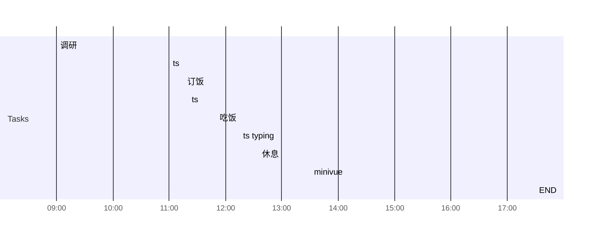

## Day Planner

```mermaid
gantt
    dateFormat  HH-mm
    axisFormat %H:%M
    %% Current Time: 下午11:42:40
    section Tasks
    调研     :09-00, 120mm
    ts     :11-00, 15mm
    订饭     :11-15, 5mm
    ts     :11-20, 30mm
    吃饭     :11-50, 25mm
    ts typing     :12-15, 20mm
    休息     :12-35, 55mm
    minivue     :13-30, 240mm
    END     :17-30, 0mm
    section Breaks

```

- [x] 09:00 调研
- [x] 11:00 ts
- [x] 11:15 订饭
- [x] 11:20 ts
- [x] 11:50 吃饭
- [x] 12:15 ts typing
- [x] 12:35 休息
- [x] 13:30 minivue
- [ ] 17:30 END