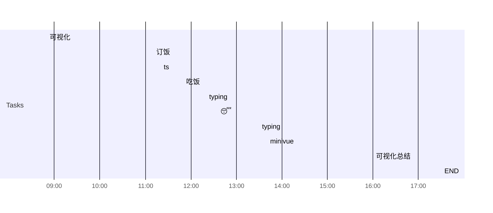

## Day Planner

```mermaid
gantt
    dateFormat  HH-mm
    axisFormat %H:%M
    %% Current Time: 下午5:33:03
    section Tasks
    可视化     :08-50, 140mm
    订饭     :11-10, 10mm
    ts     :11-20, 30mm
    吃饭     :11-50, 30mm
    typing     :12-20, 15mm
    😴     :12-35, 55mm
    typing     :13-30, 10mm
    minivue     :13-40, 140mm
    可视化总结     :16-00, 90mm
    END     :17-30, 0mm
    section Breaks

```

- [x] 08:50 可视化
- [x] 11:10 订饭
- [x] 11:20 ts
- [x] 11:50 吃饭
- [x] 12:20 typing
- [x] 12:35 😴
- [x] 13:30 typing
- [x] 13:40 minivue
- [x] 16:00 可视化总结
- [ ] 17:30 END