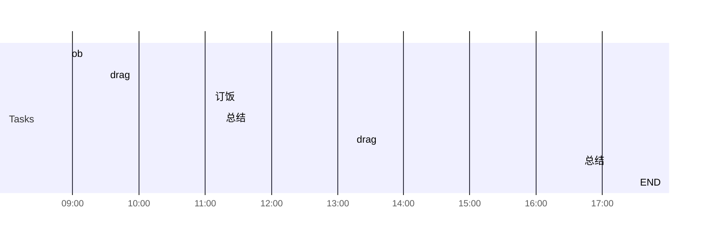

## Day Planner

```mermaid
gantt
    dateFormat  HH-mm
    axisFormat %H:%M
    %% Current Time: 下午11:35:03
    section Tasks
    ob     :08-55, 35mm
    drag     :09-30, 95mm
    订饭     :11-05, 10mm
    总结     :11-15, 118mm
    drag     :13-13, 207mm
    总结     :16-40, 50mm
    END     :17-30, 0mm
    section Breaks

```

- [x] 08:55 ob
- [x] 09:30 drag
- [x] 11:05 订饭
- [x] 11:15 总结
- [x] 13:13 drag
- [x] 16:40 总结
- [ ] 17:30 END