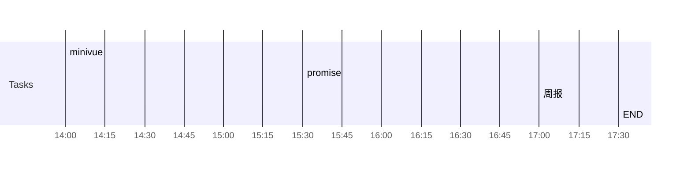

## Day Planner

```mermaid
gantt
    dateFormat  HH-mm
    axisFormat %H:%M
    %% Current Time: 下午4:49:56
    section Tasks
    minivue     :14-00, 90mm
    promise     :15-30, 90mm
    周报     :17-00, 30mm
    END     :17-30, 0mm
    section Breaks

```

- [x] 14:00 minivue
- [ ] 15:30 promise
- [ ] 17:00 周报
- [ ] 17:30 END