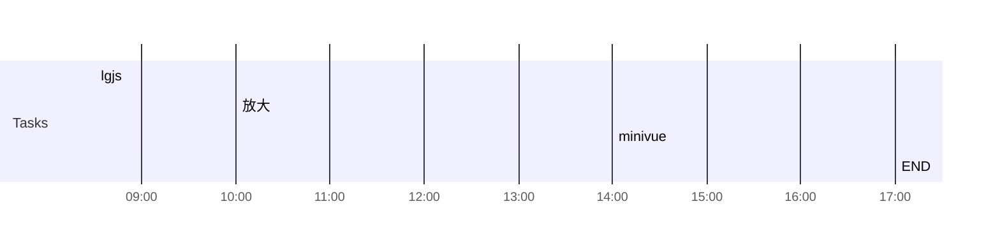

## Day Planner

```mermaid
gantt
    dateFormat  HH-mm
    axisFormat %H:%M
    %% Current Time: 下午2:36:15
    section Tasks
    lgjs     :08-30, 90mm
    放大     :10-00, 240mm
    minivue     :14-00, 180mm
    END     :17-00, 0mm
    section Breaks

```

- [x] 08:30 lgjs
- [x] 10:00 放大
- [ ] 14:00 minivue
- [ ] 17:00 END