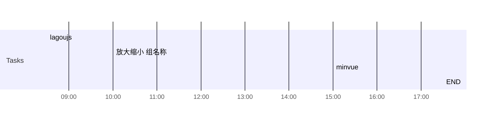

## Day Planner

```mermaid
gantt
    dateFormat  HH-mm
    axisFormat %H:%M
    %% Current Time: 下午6:00:37
    section Tasks
    lagoujs     :08-30, 90mm
    放大缩小 组名称     :10-00, 300mm
    minvue     :15-00, 150mm
    END     :17-30, 0mm
    section Breaks

```

- [x] 08:30 lagoujs
- [x] 10:00 放大缩小 组名称
- [x] 15:00 minvue
- [ ] 17:30 END